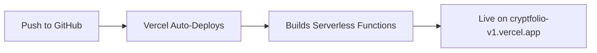

# Vercel Deployment Guide - NiceHash API Integration

## 🚀 Quick Start

This guide will get your CryptFolio app deployed on Vercel with working NiceHash API integration.

---

## 📋 Prerequisites

1. GitHub account (you already have this)
2. Vercel account (free - sign up at https://vercel.com)
3. Your repository pushed to GitHub

---

## ⚡ Step-by-Step Setup

### Step 1: Create Vercel Serverless Function

Create a new folder and file in your project:

**File: `api/nicehash.js`**

This will be your API proxy that runs on Vercel's servers (no CORS issues).

### Step 2: Update Frontend Code

Update `scripts.js` to detect environment and use proxy when deployed.

### Step 3: Deploy to Vercel

1. Go to https://vercel.com
2. Click "Sign Up" and sign in with GitHub
3. Click "Add New Project"
4. Import your `cryptfolio-v1` repository
5. Click "Deploy"

That's it! Vercel will automatically:
- ✅ Detect and deploy your serverless functions
- ✅ Build your site
- ✅ Give you a production URL (e.g., `cryptfolio-v1.vercel.app`)

---

## 📁 File Structure

```
cryptfolio-v1/
├── api/
│   └── nicehash.js          ← Serverless function (handles API calls)
├── index.html
├── scripts.js                ← Updated to use proxy
├── styles.css
└── vercel.json              ← Configuration (optional)
```

---

## 🔧 Configuration

### Optional: Add `vercel.json` for custom settings

```json
{
  "version": 2,
  "builds": [
    {
      "src": "api/**/*.js",
      "use": "@vercel/node"
    }
  ],
  "routes": [
    {
      "src": "/api/(.*)",
      "dest": "/api/$1"
    }
  ]
}
```

---

## 🧪 Testing

### Local Testing (with Vercel CLI)

```bash
# Install Vercel CLI
npm install -g vercel

# Run locally
vercel dev
```

This runs your app at `http://localhost:3000` with serverless functions working!

### Production Testing

After deploying:
1. Visit your Vercel URL (e.g., `https://cryptfolio-v1.vercel.app`)
2. Open browser console (F12)
3. Enable EasyMining with your NiceHash API credentials
4. Check console for:
   ```
   ✅ Using Vercel proxy for API calls
   ✅ Live data fetched successfully from NiceHash API
   Available BTC: 0.00012345
   Active Packages: 3
   ```

---

## 🔒 Environment Variables (Optional)

For extra security, you can store API credentials as environment variables:

1. Go to your Vercel project dashboard
2. Click "Settings" → "Environment Variables"
3. Add variables:
   - `NICEHASH_API_KEY`
   - `NICEHASH_API_SECRET`
   - `NICEHASH_ORG_ID`

Then update the serverless function to use `process.env.NICEHASH_API_KEY` etc.

---

## 📊 Deployment Process



Every time you push to GitHub, Vercel automatically redeploys!

---

## 🐛 Troubleshooting

### Function Not Found (404)
- Check that `api/nicehash.js` exists
- Verify the file exports `module.exports` or `export default`
- Try redeploying

### CORS Still Happening
- Make sure you're using the deployed Vercel URL
- Check console for "Using Vercel proxy" message
- Verify `USE_PROXY` is true

### API Errors
- Check serverless function logs in Vercel dashboard
- Verify NiceHash API credentials are correct
- Check request/response in Network tab

---

## 🎯 Next Steps

1. ✅ Create `api/nicehash.js` (I'll do this for you)
2. ✅ Update `scripts.js` (I'll do this for you)
3. 🔲 Push changes to GitHub
4. 🔲 Deploy to Vercel
5. 🔲 Test with real NiceHash credentials
6. 🎉 Enjoy live data!

---

## 💡 Benefits of Vercel

- ✅ **Free tier** is generous
- ✅ **Automatic deployments** from GitHub
- ✅ **Global CDN** for fast loading
- ✅ **Automatic HTTPS**
- ✅ **Serverless functions** included
- ✅ **Zero configuration** needed
- ✅ **Custom domains** supported

---

## 📞 Support

If you get stuck:
1. Check Vercel deployment logs
2. Check browser console
3. Check Network tab for failed requests
4. Refer to [Vercel Serverless Functions Docs](https://vercel.com/docs/concepts/functions/serverless-functions)

---

Ready to deploy! 🚀
